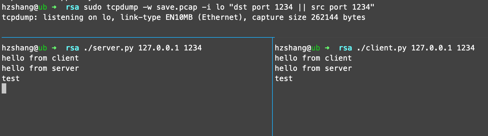
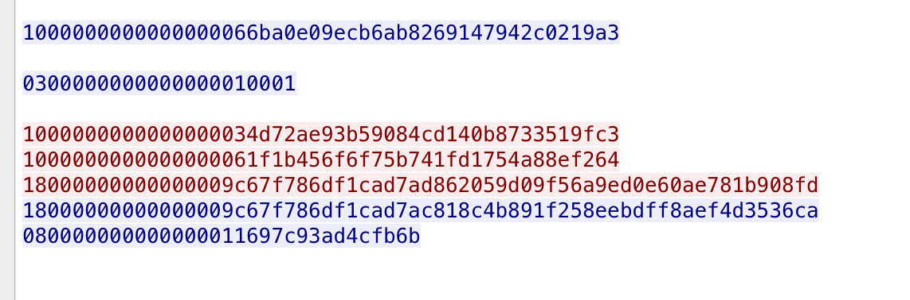

## RSA编程实现

算法|代码
----|----
|生成指定位质数算法| `primelib.cpp:get_prime`|
|Miller-Rabin的质数检验算法|`primelib.cpp:is_prime`|
|欧几里得算法求最大公约数|`util.cpp:m_gcd`|
|扩展的欧几里得算法求逆元|`util.cpp:invert`| 

> 编译源代码需要使用gmp和boost库，在rsa_src目录make，会在上层目录生成rsa.so库供python使用  

## 密钥交换
本实验实现的场景是一个端到端的tcp加密通信，首先服务器监听端口，一旦客户端连接，向客户端发送自己的RSA公钥。客户端收到RSA公钥以后，随机生成DES加密的key和CBC模式加密的初始向量，并通过公钥加密将其发送给服务端，服务端收到key和iv以后使用rsa私钥解密，双方开始des加密通信。实验代码参见client.py server.py  

## 演示

实验的使用本地的1234端口进行通信，并且使用tcpdump抓包。双方发送的协议规定，每次发送数据的前8位表示发送数据的长度，并用小端法表示。追踪tcp流，可以看到首先连接建立时，首先服务端发送自己128位的N和e(65537)，客户端收到后发送两个包，分别是自己的DES的key和iv，接下来开始进行加密通信。

